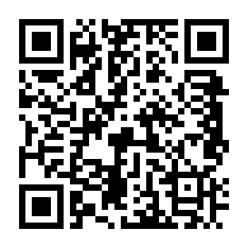
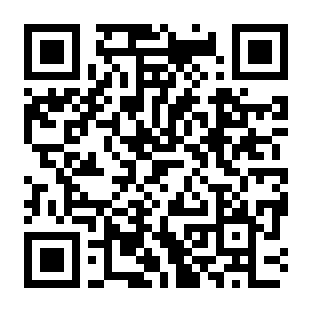

[Русский](README.ru.md) · **English**

# WinVNC

A macOS menu bar app that streams the **Claude Desktop** window over VNC (RFB) —
to an iPad, for example.

The point is to work with Claude Desktop from a tablet without occupying the
Mac's screen: for the duration of a session it brings up a virtual HiDPI
display, moves the window there, and when the client disconnects it puts the
window back and shuts the virtual display down.

> ⚠️ **No authentication.** The server accepts RFB connections with security
> type `None` and listens on `0.0.0.0`. Anyone who can reach port 5901 gets
> full control of the window and keyboard. This is meant to run **inside a
> trusted network only** — over WireGuard, for instance. Do not expose the port
> to the internet.

## How it works

| File | Responsibility |
| --- | --- |
| [`main.swift`](Sources/main.swift) | Menu bar item, session lifecycle, watchdog |
| [`RFBServer.swift`](Sources/RFBServer.swift) | RFB 3.8: handshake, frames, input |
| [`Framebuffer.swift`](Sources/Framebuffer.swift) | Screen capture via ScreenCaptureKit |
| [`VirtualDisplay.swift`](Sources/VirtualDisplay.swift) | Virtual display via `betterdisplaycli` |
| [`WindowResizer.swift`](Sources/WindowResizer.swift) | Moving the window to the virtual display and back (Accessibility) |
| [`Input.swift`](Sources/Input.swift), [`Keymap.swift`](Sources/Keymap.swift) | Mouse and keyboard injection via `CGEvent` |
| [`PixelFormat.swift`](Sources/PixelFormat.swift), [`Deflater.swift`](Sources/Deflater.swift) | Pixel format conversion and zlib frame encoding |
| [`Log.swift`](Sources/Log.swift) | Diagnostics in `/tmp/winvnc.log` |

Each client is served by two threads: the reader handles mouse and keyboard
immediately, while a separate sender captures and ships frames. Otherwise input
events queue up behind video and the pointer lags badly.

The capture target is the **entire virtual display**, not the window. A
display's geometry stays fixed for the whole session, so pointer coordinates map
exactly; a window, by contrast, changes size while you work, which is what made
the coordinates drift.

## Requirements

- macOS on Apple Silicon (tested on macOS 15, Mac mini).
- [BetterDisplay](https://github.com/waydabber/BetterDisplay) with a virtual
  screen named `iPadVNC`, plus the CLI:
  `brew install waydabber/betterdisplay/betterdisplaycli`.
  Its resolution list must include `1152x864` and `2304x1728` (HiDPI 2×).
- Xcode Command Line Tools (for `swiftc`).
- Permissions under System Settings → Privacy & Security: **Accessibility**
  (for input) and **Screen Recording** (for capture).

## Build and run

```bash
bash build.sh
open WinVNC.app
```

The app shows up as a display icon in the menu bar; status and client count are
in its menu. Connect with any VNC client on port `5901` (verified with
[Jump Desktop](https://jumpdesktop.com/) on iPad).

Settings live as constants in the sources: target app name and port in
[`main.swift`](Sources/main.swift), virtual screen name and size in
[`VirtualDisplay.swift`](Sources/VirtualDisplay.swift).

## Diagnostics

- `/tmp/winvnc.log` — session events and errors. On startup, if the file grew
  past 256 KB it is rotated to `winvnc.log.prev`.
- `/tmp/winvnc.crash` — fatal signals, in case the app does die.

The log is deliberately sparse: connections, virtual display up and down, window
fitting, the reason a connection ended (client closed it, vanished silently on
timeout, or a socket error code) and every error.

## Rakes already stepped on

These decisions look redundant until you know their history — don't remove them
casually:

- **`SIGPIPE`.** Writing to a socket the client has already closed kills the
  process instantly by default. The app died on every tablet disconnect with
  nothing in the log and no cleanup — the virtual display stayed up. Fixed with
  `signal(SIGPIPE, SIG_IGN)` plus `SO_NOSIGPIPE` on the socket.
- **The virtual display is identified by `displayID`** from
  `betterdisplaycli get --identifiers`, not by matching its size. The size check
  lied, and teardown reported success without shutting anything down.
- **A rectangle must never exceed the client's framebuffer.** Otherwise the
  client stretches the frame and pointer error grows from left to right. The
  server either sends `DesktopSize` or crops, but never scales.
- **The AX window size does not read back immediately.** Reading right after
  `setSize` returns the previous value, so width fitting is done with pauses.
- **Asking for exactly the display width** makes the window snap to a larger
  size, pushing its right edge — and the scrollbar — off screen. Ask for one
  point less.
- **Timeouts everywhere** a thread could get stuck: on the socket, on frame
  capture, on waiting for the sender thread, and on `betterdisplaycli` calls.
  Plus a watchdog that every 15 seconds restores the window and shuts the
  virtual display down if a session hangs or a client disappears.

<a id="donate"></a>

## Support

Built for myself and published as is. If you found it useful and feel like
saying thanks — **USDT**, two networks with negligible fees.

| **TON** | **Solana** |
| :---: | :---: |
|  |  |

**TON**:

```
UQDPB2vdH0Was8Ei4WWRUf4P15EedeRkSTvp1VeiRxctvbhJ
```

**Solana**:

```
85a1axcgiYcDDQHuAqUTVSCYdZPgtkUVxdujAyvDrddJ
```

> Send **only USDT and strictly on the network shown** — a different coin or
> network means the funds are gone for good. No memo or comment needed.
